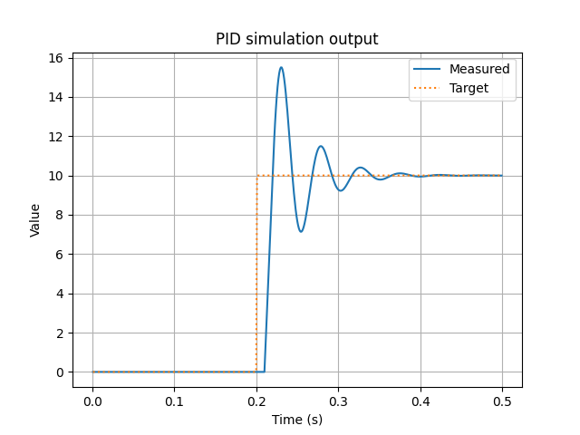

# Overview

This is a rust library implementing a PID controller. It has the following features
- Basic PID functioning
- Clamping as wind-up control of the integral term
- Calculates the derivative from the process variable instead of error to prevent kick when the target changes.

It includes some non-extensive tests:
- Individual checks of the P, I and D functionality
- A non-gated output of an example controller on a time delay plant process.

The `PID_visualiser.py` can be run on the output file to show the PID display of the example case.



# Future implementation
- Derivative filtering (imported from a filtering crate)

# Usage
## PID
To use the PID struct, the preferred method is to create a struct with only the values you want filled in. Then allow the rest to be filled in by the `::blank` associated function.

This can be seen in the following example
```rs
let mut controller = Pid {
    kp: 0.2,
    target: 15.2,
    ..Pid::blank() //The default values are filled in
};
```

The `.step` method can then be called to iterate the pid with the current measured result

```rs
let result = controller.step(3.5, 0.01);

assert_eq!(result, 0.2 * (15.2 - 3.5))
```

## Clamping
Clamping of the integral term is controlled by an Enum. Outside of this range, it will only be a PD controller.
```rs
pub enum Clamping<T> 
where
    T: Floats,
{
    None,
    LowerLimit(T),
    UpperLimit(T),
    BothLimits(T, T) //Upper, Lower
}

let mut controller = Pid {
    kp: 0.2,
    target: 15.2,
    clamping: Clamping::UpperLimit(12.0)
    ..Pid::blank() //The default values are filled in
};
```